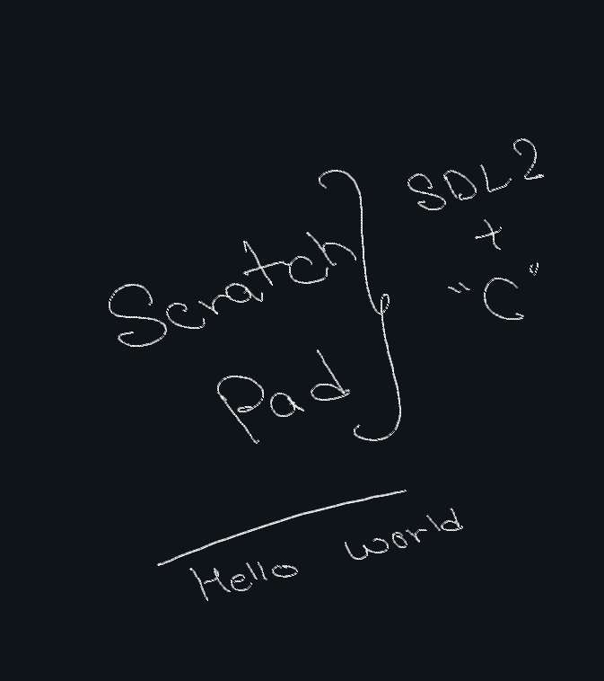

# Scratch Pad

This is project created with sdl2 in C. Last C project of mine. Currently this is a rough draft, actual app code will be added later.

## Docs:

To use: Just open "Scratch Pad". It is an executable

## TODO:

- [ ] Create from scratch again to accomodate cleaner, more efficient code. (I have rough Idea)

- [X] AntiAliasing for the lines
- [X] Delete duplicate points or points within threshold
- [X] Save frame as png
- [X] Text Rendering
- [X] Text Backtrack
- [ ] Bezier Curve
- [ ] Optimised: remove rerendering so much
- [ ] Varied stroke width: + to increase, - to decrease
- [ ] Buffer to store user keystrokes
- [ ] Better Image saving
- [ ] Icons to switch between erasor, pen, pan?: All must be 32 size from google fonts

## Examples:

- Hello World:
    
